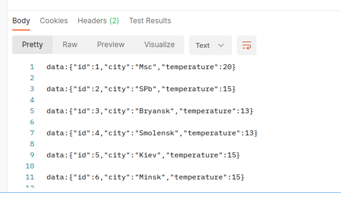
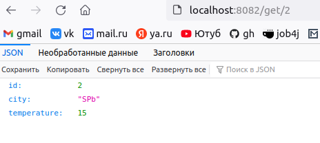
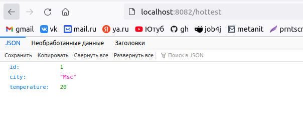
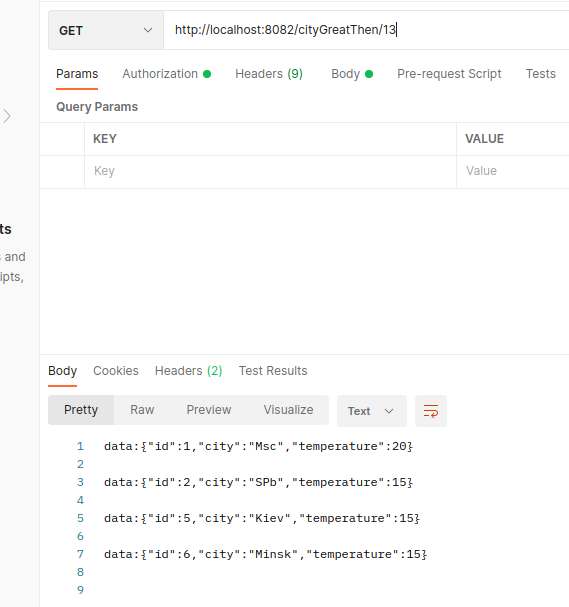

## Weather_reactive

Приложение прогноз погоды. Работать оно будет в режиме реактивного программирования.

В приложении будет два запроса.

1. Показать список всех городов с погодой.
 

2. Показать детальную погоду по выбранному городу.
 

3. Город с самой высокой температурой
 

4. Список город с валидацией
 

 
## Контакты для связи 
 arvikvan@gmail.com 
 @ArvikV
 

## Используемые технологии:
- Maven
- GitHub Action
- Spring Boot
- Hibernate
- REST
## weatherreactive
